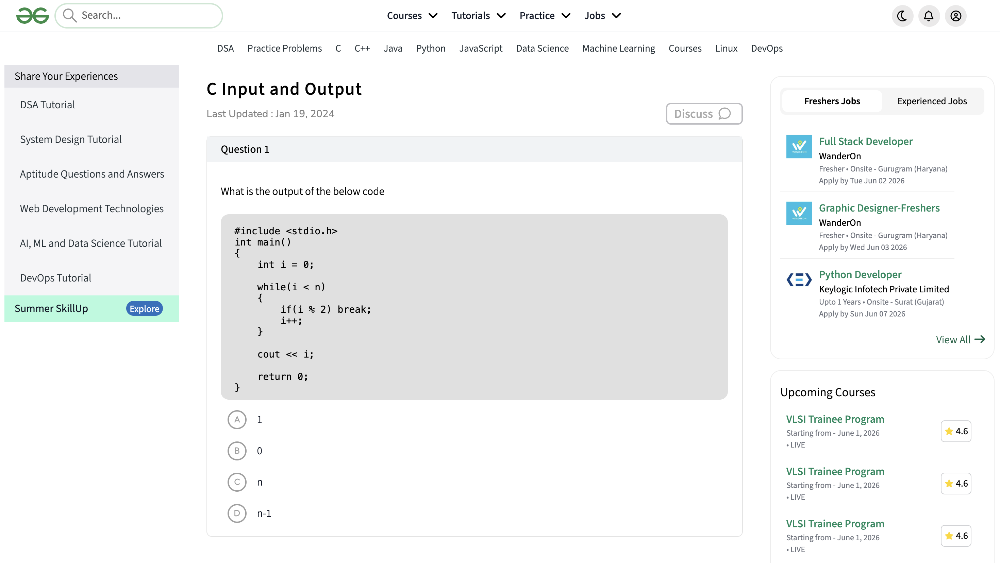

# GeeksforGeeks Quiz Clone - C Input & Output


A front-end clone of GeeksforGeeks quiz page featuring 38 multiple-choice questions on C Programming Input & Output concepts.

## 📸 Screenshot



## ✨ Features

| Feature | Description |
|---------|-------------|
| 📝 38 Questions | C Programming Input/Output focused MCQs |
| 🎨 Modern UI | Clean GeeksforGeeks style interface |
| 📱 Responsive | Works on desktop and tablets |
| 🧭 Navigation | Full header with search and menus |
| 📚 Sidebar | Tutorials and learning resources |
| 💼 Jobs Section | Fresher & experienced job listings |
| 📈 Courses | Upcoming courses with ratings |
| 🔥 Community | Trending posts feed |
| 🔗 Social Links | Connected to official GFG pages |

## 📁 Project Structure

```text
gfg-quiz-clone/
│
├── index.html
├── style.css
├── assets/
│   └── images
│
└── README.md
```